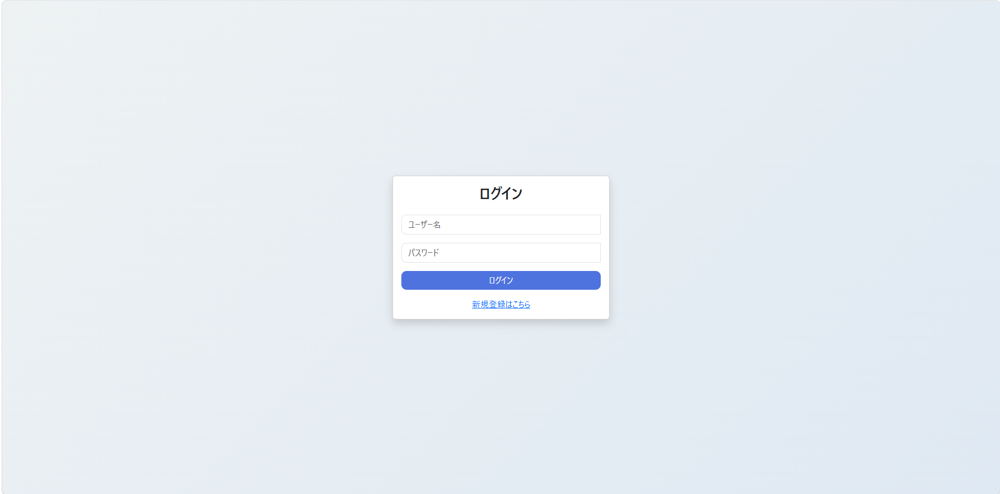
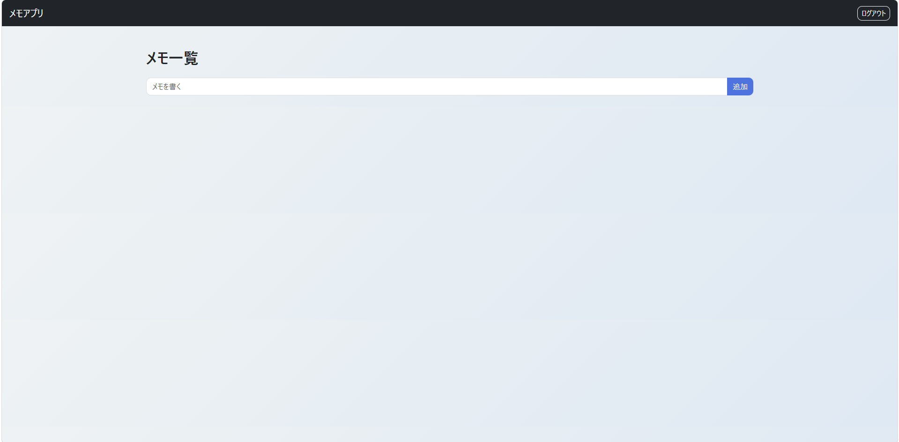

# タスク管理アプリ

## 概要

Flaskを用いて作成したタスク管理アプリです。
CRUD（追加・表示・編集・削除）機能を実装し、基本的なWebアプリの流れを理解することを目的に開発しました。

---

## 使用技術

* Python
* Flask
* SQLite
* Bootstrap

---

## 機能

* タスクの追加
* タスクの編集
* タスクの削除
* タスク一覧表示

---

## 画面イメージ

### ログイン画面

### メモ一覧画面

---

## 工夫した点

* SQLiteを使用し、データの永続化を実現
* POST後にリダイレクトを行うことで二重送信を防止（PRGパターン）
* Bootstrapを使用してUIを改善し、視認性と操作性を向上

---

## 起動方法

pip install -r requirements.txt
python app.py

---

## 初期設定

初回起動時にデータベース（SQLite）が自動作成されます。

---

## 今後の改善点

* ログイン機能の追加
* 入力バリデーションの強化
* UI/UXのさらなる改善

---
